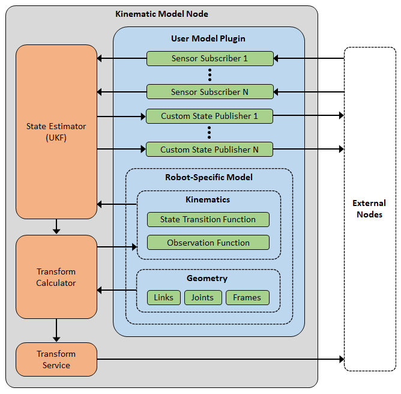

# kinematic_model

## Table of Contents
1. [Overview](#1-overview): Brief introduction to the kinematic_model package
2. [Details](#2-details): Detailed information about package features and functionality
3. [Installation](#3-installation): Instructions for installing the package
4. [Usage](#4-usage): Instructions for using the package

## 1: Overview

The kinematic_model package provides two primary functions:
1. Internally model the kinematics of a robot using an Unscented Kalman Filter (UKF)
2. Provide real-time calculations of transforms between coordinate frames (alternative to tf/tf2)

At a high level, this package allows a user to develop a very simple plugin that defines the geometry/kinematics of their robot. The user's plugin can then be loaded by the kinematic_model node, which internally handles state estimation and transform calculations.



**Features:**

- Plugin structure allow models to be easily created, loaded, and run for any type of robot
- Centralizes state estimation and transform calculation, increasing efficiency and reducing complexity of the running ROS environment
- Internally handles nonlinear state estimation for more accurate, real-time estimations of the robot's state (e.g. pose, joint positions, etc.)
- Transform calculations are more accurate since they are based on state estimations and not raw, noisy sensor data
- Extremely high-efficiency transform service for calculating transforms between coordinate frames

**Advantages over tf2:**

- Orders of magnitude increase in efficiency for both computation and bandwidth
- Transforms are calculated with higher accuracy thanks to integration with state estimation
- Nodes (especially sensor drivers) do not need to broadcast transform information and do not need awareness of robot geometry (e.g. frames)

**Tutorials:**

See the [kinematic_model_examples](https://github.com/pcdangio/ros-kinematic_model_examples) package for various examples using kinematic_model.

## 2: Details

The purpose of the kinematic_model package is to provide a plugin-based, centralized node for modeling the kinematic state of a robot in real time while simultaneously providing a service for geometric transforms.

At a high level:
1. The user develops a custom plugin for a robot that contains information about the robot's geometry and models it's kinematics
2. The user instructs the kinematic_model node on which plugin to use via a simple ROS parameter
3. The kinematic_node handles the state estimation, and simultaneously offers a get_transform ROS service

### 2.1: Plugins

Plugins have four primary responsibilities:

**Responsibility 1: Specify the robot geometry**

The kinematic_model node needs to understand the robot's geometry in order to calculate transformations between the robot's various frames. This package uses a special "design" structure that allows the plugin to create and connect geometry objects. These objects include:

- Links: A single, physical body within the robot.
- Joints: A dynamic connection between two links.
- Frames: A user-defined coordinate frame that can be attached to a link or joint.

These objects are connected via "attachments". An attachment may be fixed or dynamic, and there are no limitations on which objects can be attached together. For example, you may connect two links with a fixed attachment. You may also connect multiple joints together in series to create a 3DOF ball joint.

Joints and dynamic attachments must be tied to variables in the model's state vector. Take for example a revolute joint, which has a single axis of rotation. There must be a variable in the model's state vector that describes the angular position of that joint. This allows kinematic_model to internally calculate transforms using the real-time model state.

For simplicities sake, only two types of joints exist: revolute and prismatic. You may directly attach multiple joints together (without a link inbetween) to create more complex joints, such as a universal joint or a ball joint.

One may ask why kinematic_model doesn't use URDF or SDF for specifying robot geometry, and the answer is simple: both URDF and SDF use limiting and counter-intuitive methods for attaching geometry objects together. This package uses a custom procedure which drastically simplifies the process of "building" a robot geometry model while simultaneously allowing more flexibility.

**Responsibility 2: Model the robot's kinematics**

The kinematic_model node needs to understand the robot's kinematics in order to perform state estimation. This package internally uses an Unscented Kalman Filter (UKF) from the [kalman_filter](https://github.com/pcdangio/ros-kalman_filter) package for running state estimation calculations. The plugin must specify two different models:

1. State Transition Model: Predicts the current state of the model based on the previous state (and inputs if present)
2. Observation Model: Maps sensor measurements to variables in the model state.

These models are specified by overriding the plugin's base class methods for `state_transition()` and `observation()`. See the [Usage](#4-usage) section for more details.

The plugin's model functions may directly access transforms from it's base class using the `get_transform()` function. Many observation models require transformations to map sensor measurements to states, for example mapping a GPS measurement from the "gps_sensor" frame to a state represented in the "robot" frame.

Because the kinematic_model uses a UKF, it can handle both linear AND nonlinear models. It also doesn't require you to specify jacobians (like with the Extended Kalman Filter), drastically simplifying the model while still being able to handle nonlinearity.

The plugin is also responsible for setting the process covariance matrix, Q. The matrix is stored by the plugin's base class, and may be set once or modified at any time by the plugin.

**Responsibility 3: Provide the internal state estimator with sensor measurements**

The plugin must receive sensor measurements and pass them on as observations to the kinematic_model's state estimator. The reason for this is that each robot uses different sensors, so the robot-specific plugin is the correct place to subscribe to ROS sensor messages and parse them. Each time a new sensor measurement is received, the plugin must pass it into the state estimator via the `new_observation()` function. See the [Usage](#4-usage) section for more details.

A great feature of the kinematic_model's state estimator is that it can handle measurements that arrive at different/variable rates. The state estimator will use whatever measurements are available when performing its "measurement update" step.

An added bonus of this approach is that kinematic_model may use data from ROS sensor nodes without imposing any requirements on the sensor nodes themselves. In tf2, sensors are tasked with sending transform messages. This is a form of contamination, as a sensor node must programmatically depend on tf2 and also have knowledge of robot-specific coordinate frames. The kinematic_model package removes this contamination, making the ROS environment more elegant. It also means that kinematic_model can use data from ANY type of node.

The plugin is also responsible for setting the measurement noise covariance matrix, R. The matrix is stored by the plugin's base class, and may be set once or modified at any time by the plugin. Take for example the ROS [sensor_msgs/NavSatFix](http://docs.ros.org/en/api/sensor_msgs/html/msg/NavSatFix.html) message, which includes both a GPS measurement and covariance. In the subscriber's callback, your plugin may pass the measurement in via `new_observation()` and then update the R matrix using the real-time covariance measurements provided in the message.

The plugin may optionally use ROS messages to calculate or receive the initial state of the model (e.g. a service for setting the robot's initial state). The plugin may then use the base class's `initialize_state()` message to reset the state and associated covariance to the desired values.

**Responsibility 4: Publish state information externally as needed**

Each individual robot will have certain information about it's kinematic state that it may want to publish externally. For example, a robot may want to publish it's pose, or publish the real-time estimated state of each joint. This will differ for each robot; thus the plugin is the proper place for publishing custom ROS messages from.

The plugin may make use of the base plugin's `on_state_update()` method to publish information each time a new state is calculated, or it may use a ROS Timer to publish state information at different rates. See the [Usage](#4-usage) section for more details.

### 2.2: Base Class

The kinematic_model base class is the class that all plugins derive from. It contains all functionality related to state estimation, transform calculation, and serving transforms externally. It has two primary responsibilities:

**Responsibility 1: Continuously estimate the kinematic state of the robot**

The base class uses an internal Unscented Kalman Filter (UKF) from the ROS [kalman_filter](https://github.com/pcdangio/ros-kalman_filter) package for performing real-time, nonlinear state estimation. The state estimator runs at a predefined rate, which is specified as a simple ROS parameter. Upon each iteration, the state estimator:

1. Performs an prediction step using the plugin's state transition model.
2. Uses available measurements to perform a measurment update step.

Ultimately, this allows kinematic_model to calculate more accurate estimates of the actual kinematic state of the robot.

See the [kalman_filter](https://github.com/pcdangio/ros-kalman_filter) package for additional detail on how the internal state estimator works.

**Responsibility 2: Calculate transforms on an as-needed basis**

The base class provides a real-time transform calculation capability for use in two different scenarios:

1. The plugin may internally use the `get_transform()` function to get transforms as needed. For example, the plugin's `observation()` model function may use it to get transforms for mapping sensor measurements to state variables.
2. The ROS `get_transform` service, which allows external nodes to query kinematic_model for coordinate frame transforms.

The transform capability is broken into two areas: the geometry graph and transform calculation. The geometry graph builds a representation of the robot's physical structure using the "design" structure provided by the plugin. When a transform is requested, the graph is used to find the path between the request's source frame and target frame. The path is an ordered list of geometric objects (links, joints, frames) that must be traversed to get from the source frame to the target frame. The kinematic_model package uses a custom-designed graph for extreme efficiency in solving geometric paths. It also uses internal caching to prevent duplicative computations of paths.

Once a path is solved between the source and target frames, the transform calculator is used to find the transform between the source and target frame. Recall that geometric objects (links, joints, frames) are all connected via attachments, which are static or dynamic poses between the parent object and the child object. The transform calculator steps through each attachment in the objects path, and chains transforms together to calculate the final transform from source to target. Furthermore, joints are special objects in that a joint's position is a transform. So as the transform calculator steps through the path, it chains both attachment transforms AND joint transforms. Dynamic attachments and joints each depend on variables in the kinematic model's state. These state variables (e.g. joint position, attachment pose, etc) are constantly being updated by the kinematic_model's state estimator. The transform calculator uses the real-time state variables when calculating these transforms, so as a joint position changes, the calculated transform through that joint also changes.

Compared to tf2, kinematic_model's centralized transform calculation strategy offers significant increases in accuracy, computational efficiency, and bandwidth efficiency:

| kinematic_model | tf2 |
| - | - |
| All coordinate frame transforms calculated in a single place with zero duplication | Every node must calculate it's own coordinate frame transforms, causing significant numbers of duplicate calculations |
| Specific transforms are calculated and sent only when requested | Every transform is calculated and published to all nodes regardless of if/when they are needed |
| Can receive data from any sensor and any ROS message type | Only compatible with sensor nodes that depend on tf2 and publish tf2 messages |
| Sensor nodes do not need awareness of robot geometry | Sensor nodes must be programmed or configured to understand robot-specific frames/geometry |

### 2.3: Node

The kinematic_model node is simply an executable wrapper around the kinematic_model's base class and plugin. Upon startup, the node reads the `~/plugin_path` parameter to determine which user model plugin to load and run. Once the plugin is successfully loaded, the node begins normal operation.

## 3: Installation

This section provides instructions for downloading kinematic_model and compiling it.

**Dependencies**

- [kalman_filter](https://github.com/pcdangio/ros-kalman_filter): A ROS package providing c++ libraries for Kalman Filtering.
- [transform](https://github.com/pcdangio/ros-transform): A ROS package providing c++ libraries for geometric transforms.
- [transform_msgs](https://github.com/pcdangio/ros-transform_msgs): ROS messages and services for geometric transforms.
- [Eigen3](https://eigen.tuxfamily.org/index.php?title=Main_Page): A c++ library used for matrix/vector calculations (included in ROS).

**Download & Build**

The following bash commands may be used to clone and build kinematic_model:

```bash
# Switch to your ROS catkin workspace directory
cd my_ros_workspace

# Source ROS environment if you haven't already
source /opt/ros/melodic/setup.bash

# Clone dependencies into src/ if you haven't already
git clone https://github.com/pcdangio/ros-kalman_filter.git src/kalman_filter
git clone https://github.com/pcdangio/ros-transform.git src/transform
git clone https://github.com/pcdangio/ros-transform_msgs.git src/transform_msgs

# Clone the kinematic_model package into src/
git clone https://github.com/pcdangio/ros-kinematic_model.git src/kinematic_model

# Build with catkin_make
# NOTE: Compiling as a release with "catkin_make -DCMAKE_BUILD_TYPE=release" gives ~10x improvement in Eigen's computation speed
catkin_make
```

**NOTE:** This package has been developed and tested on ROS Melodic.

## 4: Usage

Using kinematic model can be broken down into three steps:

1. Making your robot-specific plugin
2. Launching the kinematic_model node with your plugin
3. Interfacing other nodes with the kinematic_model node

Each of these steps are broken down in detail below.

You may also find specific code examples in the [kinematic_model_examples](https://github.com/pcdangio/ros-kinematic_model_examples) package.

### 4.1: Making your robot specific plugin

The first step to using kinematic_model is building your robot-specific plugin, which specifies the robot's geometry and kinematics. This is accomplished by extending the kinematic_model base class, and overriding specific abstract functions. A minimal plugin class is demonstrated below:

```cpp
// This is an example of a minimum kinematic_model plugin.

// Include the base kinematic_model class.
#include <kinematic_model/kinematic_model.hpp>

// Create a class that implements your plugin.
class my_model_t
    // Derive your class from the kinematic_model_t base class.
    : public kinematic_model::kinematic_model_t
{
public:
    // A default constructor is required.
    my_model_t()
        // Initialize base kinematic_model_t class.
        // This example uses 3 state variables and 2 sensors/observers.
        : kinematic_model_t(3,2)
    {
        // Initialize your plugin here.
    }

    // Override this base class method to specify your geometry.
    void build_geometry(kinematic_model::geometry::design_t& design) const override
    {
        // Add your robot's geometry to the "design" reference parameter.
    }

    // Override this base class method to implement your robot's state transition model.
    void state_transition(const Eigen::VectorXd& xp, Eigen::VectorXd& x) const override
    {
        // Use the prior state, xp, as well as other inputs from your class, to calculate
        // the new state, x.
    }

    // Override this base class method to implement your robot's observation model.
    void observation(const Eigen::VectorXd& x, Eigen::VectorXd& z) const override
    {
        // Use the current state, x, to calculate the expected observations, z.
    }
};

// Register your plugin class so that kinematic_model's node can load it.
REGISTER_PLUGIN(my_model_t)
```

Your plugin can also subscribe to messages and publish messages however needed.

**Building Geometry**

The `build_geometry` method is used to specify your robot's geometric configuration. The `design_t` structure passed into this function allows you to add geometric objects (links, joints, and frames) to the design and specify how they are connected. See the following example:

```cpp
void build_geometry(kinematic_model::geometry::design_t& design) const override
{
    // Create robot's links.
    auto link_a = design.create_link("link_a");
    auto link_b = design.create_link("link_b");

    // Create robot's joints.
    auto joint_ab = design.create_joint("joint_ab", geometry::object::joint_t::type_t::REVOLUTE, 0);

    // Create robot's frames.
    auto frame_x = design.create_frame("frame_x");

    // Add objects to the model's design.
    // First, add link_a as the base link (e.g. it has no parent).
    design.add_object(link_a);
    // Connect joint_ab to link_a, with the desired x/y/z/roll/pitch/yaw pose relative to link_a (parent).
    design.add_object(joint_ab, link_a, 1, 0, 0, 0, 0, 0);
    // Connect link_b to joint_ab, with the desired x/y/z/roll/pitch/yaw pose relative to joint_ab (parent).
    design.add_object(link_b, joint_ab, 1, 0, 0, 0, 0, 0);
    // Attach frame_x to link_b, with the desired x/y/z/roll/pitch/yaw pose relative to link_b (parent).
    design.add_object(frame_x, link_b, 2, 2, 0, 3.14159, 0, 0);
}
```

Keep in mind that each geometric object has it's own coordinate frame, which can be referenced by the object's name when requesting transforms. For example, the above design allows you to call get_transform("frame_x", "link_a").

For more in-depth examples, see the [kinematic_model_examples](https://github.com/pcdangio/ros-kinematic_model_examples) package.

**State Transition**

The `state_transition` method defines the kinematics of your robot. It specifies how your robot moves using knowledge of the robot's prior state and any additional inputs your model requires. The method provides you with the prior state, `xp`, for your calculations. You must calculate the predicted current state, `x`. Your method may read data from your class (e.g. an input), but due to the nature of kinematic_model's internal Unscented Kalman Filter, your method must not alter any data within your plugin class (hence the `const` qualifier). For convenience, the base class provides an accurate measurement of the time difference (`dt`) between calls. See the following example:

```cpp
void state_transition(const Eigen::VectorXd& xp, Eigen::VectorXd& x) const override
{
    // Implement a standard 1D motion model.
    // NOTE: dt() time difference is measured and provided by base class.

    // Calculate predicted position:
    x(0) = xp(0) + xp(1)*dt() + 0.5*xp(2)*dt()*dt();

    // Calculate predicted velocity.
    x(1) = xp(1) + xp(2)*dt();

    // Assume acceleration is constant.
    x(2) = xp(2);
}
```

For more in-depth examples, see the [kinematic_model_examples](https://github.com/pcdangio/ros-kinematic_model_examples) package.

**Observation**

The `observation` method maps your robot's various sensors to the robot's states. In implementation, it actually maps your robot's states to expected sensor measurements. For example, if you know your robot's current position, this method should calculate what the expected GPS sensor measurement should be. The method provides you with the "known" state, `x`, and you must calculate the "expected" sensor measurements, `z`. This method may use the base class's `get_transform()` method to get the current transforms between coordinate frames to aid in calculating expected sensor measurements. See the following minimal example:

```cpp
void observation(const Eigen::VectorXd& x, Eigen::VectorXd& z) const override
{
    // In this example, we have a position sensor and an acceleration sensor.

    // The position sensor z(0) directly observers/measures the position state x(0).
    z(0) = x(0);

    // The acceleration sensor z(1) directly observers/measures the acceleration state x(2).
    z(1) = x(2);
}
```

For more in-depth examples, see the [kinematic_model_examples](https://github.com/pcdangio/ros-kinematic_model_examples) package.

**Reading Sensors**

The plugin has the added responsibility of reading sensor data and providing it to the kinematic_model's internal state estimator. This is done by adding sensor message subscribers to the plugin, and passing sensor measurements to the state estimator via the base class's `new_observation` method.  See the following example snippet:

```cpp
...
class my_model_t
    : public kinematic_model::kinematic_model_t
{
private:
    ros::Subscriber m_subscriber_sensor;
    void callback_sensor(const std_msgs::Float64ConstPtr& message)
    {
        // Pass sensor's measurement to the base class's state estimator.
        new_observation(0, message->data);
    }

public:
    my_model_t()
        // Model has single state and single sensor.
        : kinematic_model_t(1,1)
    {
        // Set up subscriber for sensor messages.
        ros::NodeHandle node;
        m_subscriber_sensor = node.subscribe("sensor", 1, &my_model_t::callback_sensor, this);
    }
...
```

For more in-depth examples, see the [kinematic_model_examples](https://github.com/pcdangio/ros-kinematic_model_examples) package.

**Publishing Information**

Your plugin may desire to publish robot-specific state information and messages to external nodes. This is done by adding publishers to the plugin. There are two ways to regularly publish data:

1. Override the base class's `on_state_update()` method, which automatically gets called every time a new state is calculated.
2. Use `ros::Timer` to periodically call publishing code.

See the following example snippet:

```cpp
...
class my_model_t
    : public kinematic_model::kinematic_model_t
{
private:
    // Set up custom state publisher.
    ros::Publisher m_state_publisher;

    // Override the on_state_update() method to publish a new message each time a new state is calculated.
    void on_state_update() override
    {
        // Read the current state from the base class.
        const Eigen::VectorXd& current_state = state();

        // Create your custom message.
        my_custom_package::my_custom_message msg;
        msg.position = current_state(0);
        msg.velocity = current_state(1);
        msg.acceleration = current_state(2);

        // Publish message.
        m_state_publisher.publish(msg);
    }

public:
    my_model_t()
        // Model has three states and single sensor.
        : kinematic_model_t(3,1)
    {
        // Set up custom state publisher.
        ros::NodeHandle node;
        m_state_publisher = node.advertise<my_custom_package::my_custom_message>("state", 1);
    }
...
```

For more in-depth examples, see the [kinematic_model_examples](https://github.com/pcdangio/ros-kinematic_model_examples) package.

**Compiling Your Plugin**

Obviously, your plugin will need to be implemented in it's own ROS package (and link against the kinematic_model package). It must be compiled as a shared library so that kinematic_model can dynamically load it. See the following CMakeLists.txt example:

```cmake
cmake_minimum_required(VERSION 3.0.2)
project(my_custom_package)

# Find catkin and dependencies.
find_package(catkin REQUIRED COMPONENTS
  roscpp
  kinematic_model)

# Create catkin package for this package.
catkin_package()

# Set up include directories.
include_directories(
# include
  ${catkin_INCLUDE_DIRS}
)

# Add your plugin as a shared library.
add_library(my_custom_plugin MODULE src/my_plugin.cpp)

# Ensure all custom ROS msg/srv dependencies are built first.
add_dependencies(${PROJECT_NAME} ${catkin_EXPORTED_TARGETS})
```

Building your package will result in a `libmy_custom_plugin.so` library being built. This is what the kinematic_model node will eventually load and run.

### 4.2: Launching the kinematic_model node with your plugin

The kinematic_model package provides a node that loads and executes your plugin (and it's underlying kinematic_model base class). In order to load your plugin, you must tell the kinematic_model node which plugin to load. This is done with a ROS parameter that specifies the path to the plugin's *.so file (see above section).

The node checks the `~/plugin_path` parameter to read the path to the plugin. Note that `~` is the node's private namespace!

The following example shows two simple ways to launch the kinematic_model node with your plugin:

```bash
# Example 1: pass parameter in via rosrun
rosrun kinematic_model node _plugin_path:=/some/path/to/plugin.so

# Example 2: set parameter in parameter server
rosparam set /kinematic_model/plugin_path /some/path/to/plugin.so
rosrun kinematic_model node
```

### 4.3: Interfacing other nodes with the kinematic_model node

The kinematic_model node provides a single service: `~/get_transform`. This service allows any external node to request a transform between two coordinate frames in the robot's geometry. Each geometric object (link, joint, frame) counts as a coordinate frame and may be referenced by name in the service request. If a request is made for a coordinate frame that doesn't exist, or no path exists between the two coordinate frames, the service will fail.

Keep in mind that your plugin may also publish additional information, or subscribe to external nodes, as documented in section 4.1 above.